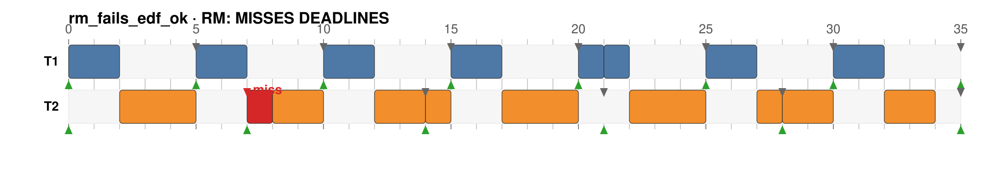
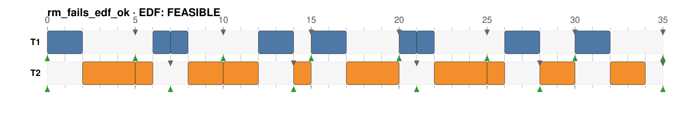

# rt-scheduler-sim

Simulador de **eventos discretos** para escalonamento de **tarefas de tempo real**. Avança de **evento em evento** (liberação e término de jobs), nunca tick a tick, e compara pelo menos dois algoritmos de escalonamento: **Rate Monotonic (RM)**, **Deadline Monotonic (DM)** e **Earliest Deadline First (EDF)**.

Trabalho da disciplina de **Sistemas de Tempo Real** (UFBA / Instituto de Computação).
Dupla: **Luis Sena** e **Antoniel Magalhães**.




Mesma carga (`U = 0,971`), dois algoritmos: RM perde o deadline de `T2` em `t=7`, EDF cumpre todos.

## Por que eventos discretos

A simulação não anda 1 unidade de tempo por vez. Ela salta direto para o próximo instante em que algo muda. Entre dois eventos, o job de maior prioridade executa sem interrupção. Os eventos são:

- **RELEASE** — uma tarefa libera um novo job;
- **COMPLETION** — um job termina sua execução.

O próximo evento é sempre `min(próxima liberação, término do job atual)`. A **preempção** aparece sozinha: ao liberar um job de prioridade maior, ele assume a CPU no próximo passo. Perda de deadline é uma **observação derivada**, não um evento que comanda o escalonador.

## Requisitos

Apenas **Python 3.9+**. Sem dependências externas (só biblioteca padrão).

## Uso rápido

```bash
# Comparar RM e EDF na mesma carga, com trace de eventos e Gantt em ASCII
python -m rtsim compare examples/rm_fails_edf_ok.json --algos RM EDF --verbose

# Rodar um único algoritmo
python -m rtsim run examples/three_tasks.json --algo EDF

# Só os testes analíticos (utilização e escalonabilidade)
python -m rtsim analyze examples/feasible.json

# Gerar um diagrama de Gantt em SVG (abre em qualquer navegador)
python -m rtsim run examples/rm_fails_edf_ok.json --algo RM --svg rm.svg
```

## Demonstração ao vivo

Um único comando roda os dois algoritmos na mesma carga e mostra o veredito lado a lado:

```text
$ python -m rtsim compare examples/rm_fails_edf_ok.json --algos RM EDF

Taskset: rm_fails_edf_ok   (n=2, hyperperiod=35)
  task     C    T    D  phase       U
  T1       2    5    5      0   0.400
  T2       4    7    7      0   0.571
  total utilization U = 0.971
  RM bound  U_lub(2) = 0.828  -> inconclusive (simulate)
  EDF test  U <= 1       -> FEASIBLE

=== Rate Monotonic (RM) ===
  -- response times --
    T1     worst response = 2    OK
    T2     worst response = 8    MISS (D=7)
  >>> RM: INFEASIBLE  (1 deadline miss(es): T2.1)
  -- Gantt --
     |1234|6789|1234|6789|1234|6789|1234|
               1         2         3
 T1 |██···██···██···██···██···██···██···|
     ^    ^    ^    ^    ^    ^    ^    ^
 T2 |··███··▒██··███··███··███··███··██·|
     ^      X      ^      ^      ^      ^

=== Earliest Deadline First (EDF) ===
  >>> EDF: FEASIBLE  (no deadline miss)
  ...
=== summary (U = 0.971) ===
  algorithm                 feasible  misses
  Rate Monotonic            NO        1
  Earliest Deadline First   yes       0
  takeaway: EDF meets every deadline where RM does not (same load, U=0.971).

legend: █ running   ▒ running late   · idle   ^ release   v deadline   X miss
```

`▒` em `t=7` é a unidade de `T2` que vazou para depois do deadline; `X` marca a perda.

## Conjuntos de tarefas (`examples/`)

| Arquivo | Utilização | RM | EDF | O que ilustra |
|---|---|---|---|---|
| `feasible.json` | 0,71 | cumpre | cumpre | abaixo do limite de Liu & Layland, ambos escalonam |
| `rm_fails_edf_ok.json` | 0,97 | **perde** | cumpre | EDF cumpre onde prioridade fixa falha |
| `three_tasks.json` | 0,65 | cumpre | cumpre | três tarefas, Gantt legível em 20 unidades |
| `overload.json` | 1,10 | perde | perde | sobrecarga (`U>1`): infeasível por qualquer algoritmo |

Formato do JSON:

```json
{
  "name": "meu_conjunto",
  "tasks": [
    { "id": 1, "name": "T1", "wcet": 2, "period": 5 },
    { "id": 2, "name": "T2", "wcet": 4, "period": 7, "deadline": 7, "phase": 0 }
  ]
}
```

`deadline` (padrão = `period`) e `phase` (padrão = `0`) são opcionais.

## Algoritmos

| Algoritmo | Prioridade | Chave (menor = maior prioridade) |
|---|---|---|
| Rate Monotonic (RM) | estática | menor **período** |
| Deadline Monotonic (DM) | estática | menor **deadline relativo** |
| Earliest Deadline First (EDF) | dinâmica | menor **deadline absoluto** |

Toda política é só uma função de chave. O motor sempre executa o job de menor chave, então preempção, prioridade fixa e dinâmica saem todas da mesma abstração.

## Análise de escalonabilidade

- **RM (suficiente):** limite de Liu & Layland `U ≤ n(2^(1/n) − 1)` (tende a `ln 2 ≈ 0,693`).
- **EDF (exato, deadline implícito):** `U ≤ 1` se e somente se escalonável.

A simulação confirma na prática o que o teste prevê na teoria.

## Arquitetura

```
rtsim/
  model.py        Task, Job, TaskSet (carrega JSON)
  events.py       tipos de evento (RELEASE, COMPLETION, PREEMPTION, MISS)
  schedulers.py   políticas RM / DM / EDF como chaves de prioridade
  simulator.py    laço de eventos: libera, escolhe, executa, termina
  metrics.py      utilização e testes de escalonabilidade
  gantt.py        diagrama de Gantt em ASCII e SVG
  cli.py          comandos run / compare / analyze
```

## Testes

```bash
python -m unittest discover -s tests -v
```

17 testes cobrindo métricas, escolha de prioridade, conservação de tempo de CPU, não-sobreposição de execução e o caso âncora (RM perde em `t=7`, EDF cumpre).

## Slides

`slides/` contém a apresentação em LaTeX/Beamer (tema DCC da UFBA) e o roteiro de falas:

```bash
cd slides && latexmk -pdf main.tex   # gera slides/main.pdf
```

- `slides/main.pdf` — apresentação compilada (15 frames, ~10 min);
- `slides/falas.md` — roteiro com as falas exatas (Luis: slides 1-7; Antoniel: slides 8-15) e tempos por slide.

Comandos da demonstração ao vivo (deixar copiados antes de apresentar):

```bash
python -m rtsim compare examples/rm_fails_edf_ok.json --algos RM EDF --verbose
python -m rtsim run examples/rm_fails_edf_ok.json --algo RM     # só RM, Gantt ASCII
python -m unittest discover -s tests                            # 17 testes passando
```

## Licença

MIT. Ver [LICENSE](LICENSE).
